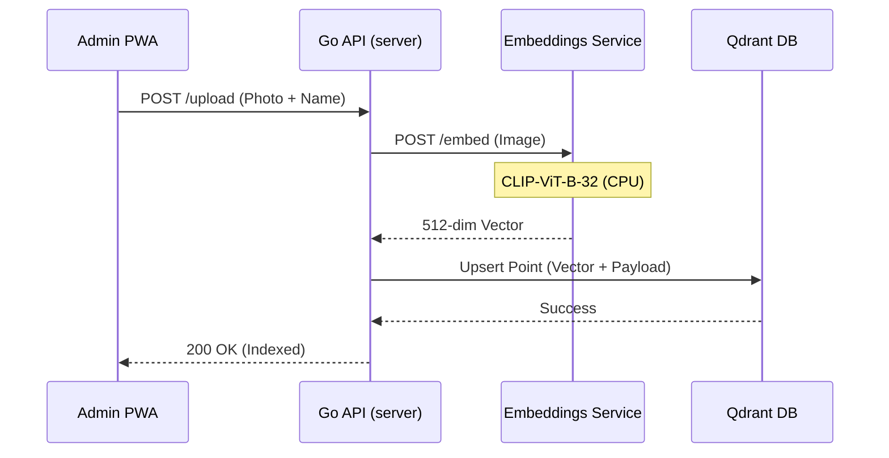
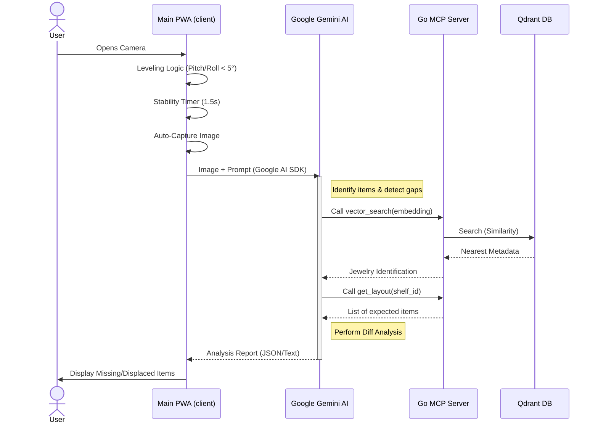

# 🏗️ ShelfScan Architectural Sequences

This document illustrates the data flow and interactions between the various components of the ShelfScan system using Mermaid diagrams.

## 1. Jewelry Inventory Onboarding (Admin Flow)
This sequence occurs when a new jewelry item is added to the system via the Admin PWA.

## 2. Shelf Scanning & AI Verification (Main Flow)
This sequence shows the interaction during a shelf check, including the leveling logic and AI orchestration.

## 3. System Components Overview

| Service | Responsibility | Technology |
| :--- | :--- | :--- |
| **Main PWA** | UI for scanning, 4K Camera, Leveling, Gemini Integration | React, Vite, Tailwind |
| **Admin PWA** | Inventory management, metadata entry | React, Vite |
| **Go API** | Bridge for inventory indexing, Qdrant orchestration | Go (Standard Library + gRPC) |
| **MCP Server** | Providing tools to the AI Agent (Search, Layout) | Go (JSON-RPC) |
| **Embeddings** | Image vectorization using CLIP models | Python, FastAPI, PyTorch (CPU) |
| **Qdrant** | High-performance vector storage and retrieval | Qdrant (Rust-based) |
