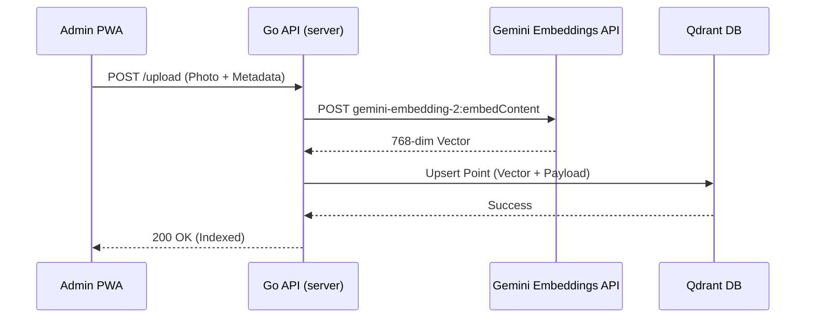
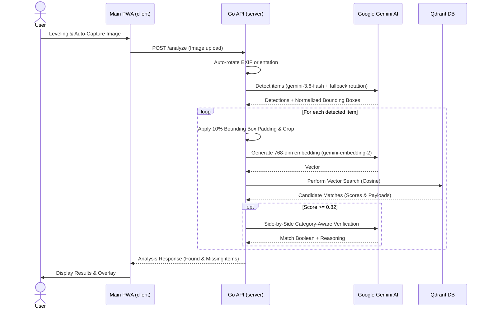

# 🏗️ ShelfScan Architectural Sequences

This document illustrates the data flow and interactions between the various components of the ShelfScan system using Mermaid diagrams.

## 1. Jewelry Inventory Onboarding (Admin Flow)
This sequence occurs when a new jewelry item is added to the system via the Admin PWA.

## 2. Shelf Scanning & AI Verification (Main Flow)
This sequence shows the interaction during a shelf check, including EXIF rotation, Gemini object detection, vector search, and two-step side-by-side verification.

## 3. System Components Overview

| Service | Responsibility | Technology |
| :--- | :--- | :--- |
| **Main PWA** | UI for scanning, camera capture, Leveling guidance | React, Vite |
| **Admin PWA** | Inventory management, metadata entry | React, Vite |
| **Go API** | Image decoding, EXIF orientation, crop padding, Gemini & Qdrant orchestration | Go (Standard Library + imaging) |
| **MCP Server** | Model Context Protocol tools implementation | Go (WebSocket/JSON-RPC) |
| **Gemini AI** | Object detection, embeddings (768-dim), and two-step verification | Google Generative AI SDK / REST |
| **Qdrant** | High-performance vector storage and retrieval | Qdrant (Rust-based) |
