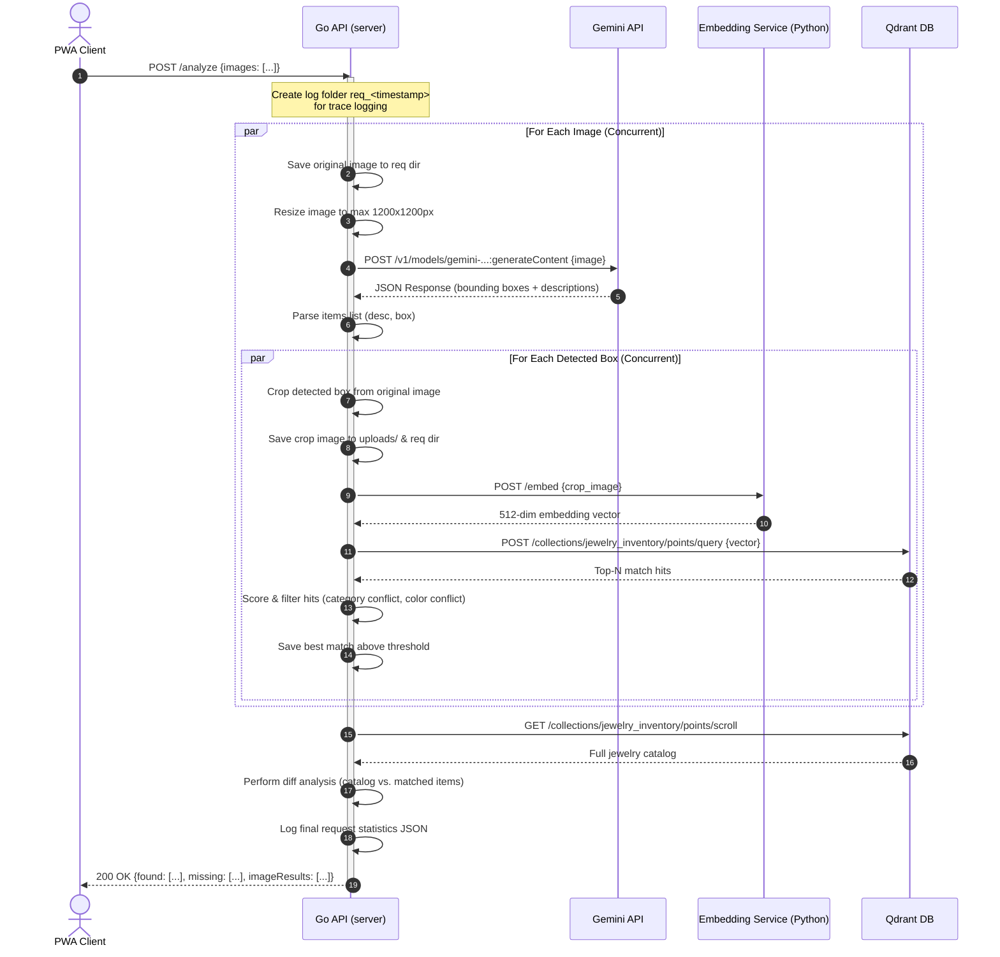
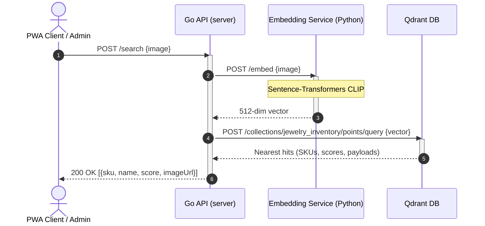
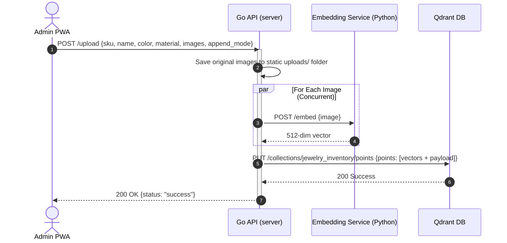

# 📊 ShelfScan API Sequence Diagrams

This document contains detailed sequence diagrams for the primary API endpoints implemented in the Go API backend.

---

## 1. Automated Shelf Analysis (`POST /analyze`)
This API endpoint receives one or more high-resolution shelf images, uses Gemini to locate items, crops detected bounding boxes, requests embeddings for each cropped item, queries Qdrant for matches, and returns an inventory comparison report (found vs. missing products).

---

## 2. Image-Based Vector Search (`POST /search`)
This endpoint accepts a photo of a single jewelry item and returns the closest matches from the Qdrant vector database.

---

## 3. Product Inventory Onboarding (`POST /upload`)
This endpoint indexes one or more images of a jewelry item, generates their embeddings, and stores them in Qdrant with associated metadata.

