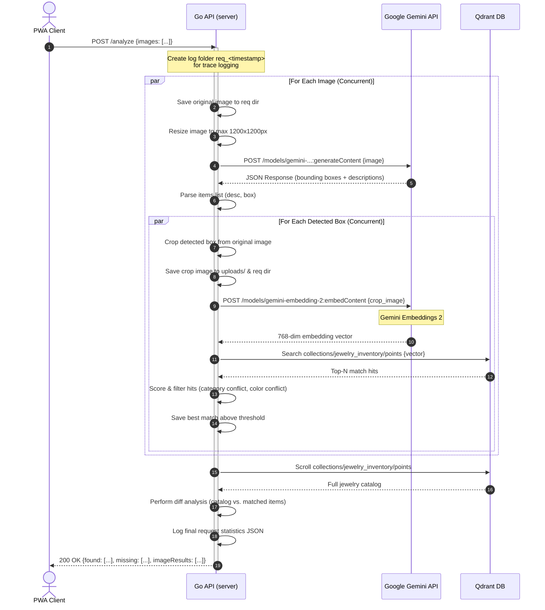
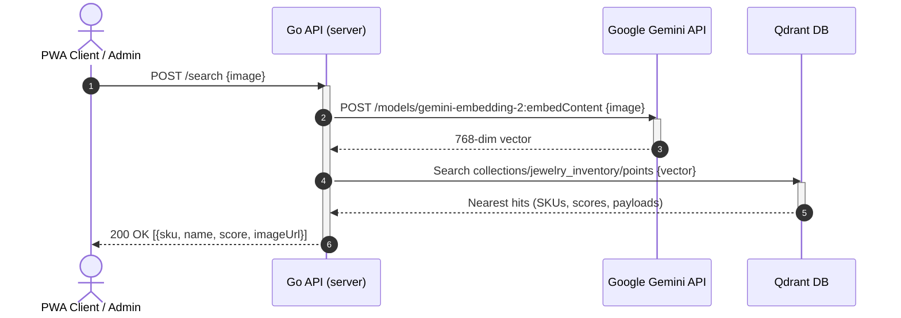
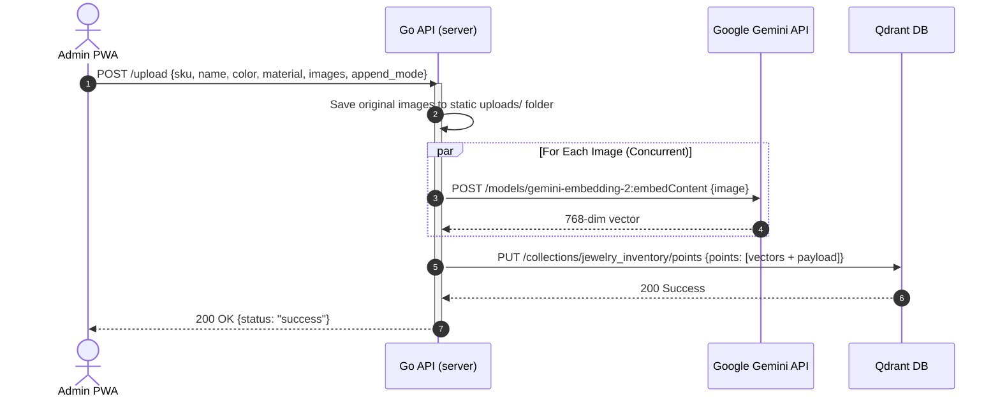
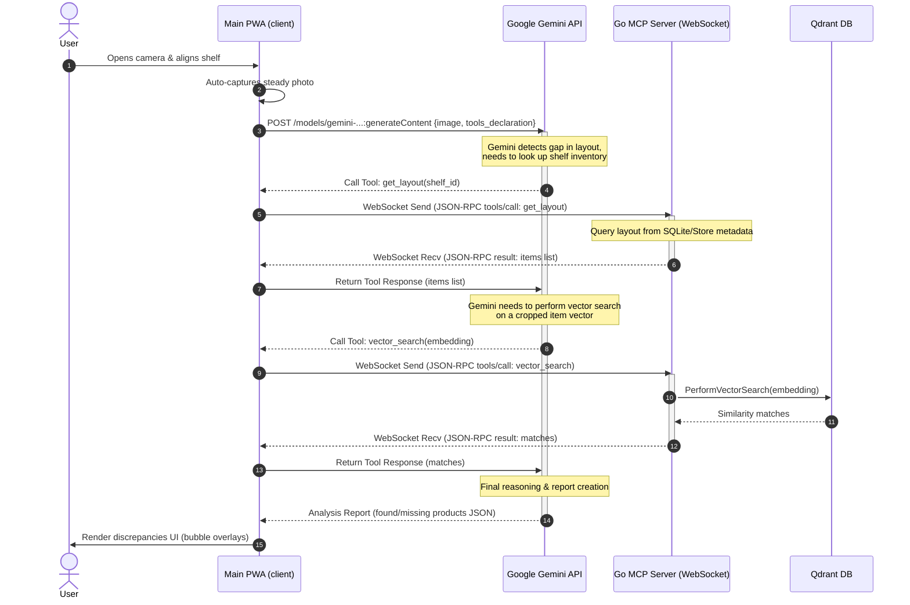

# 📊 ShelfScan API Sequence Diagrams

This document contains detailed sequence diagrams for the primary API endpoints and component interactions in the ShelfScan system.

---

## 1. Automated Shelf Analysis (`POST /analyze`)
This API endpoint receives one or more high-resolution shelf images, uses Gemini to locate items, crops detected bounding boxes, requests embeddings for each cropped item using the Gemini Embedding 2 API, queries Qdrant for matches, and returns an inventory comparison report (found vs. missing products).

---

## 2. Image-Based Vector Search (`POST /search`)
This endpoint accepts a photo of a single jewelry item, generates its vector using Gemini Embeddings 2, and returns the closest matches from the Qdrant vector database.

---

## 3. Product Inventory Onboarding (`POST /upload`)
This endpoint indexes one or more images of a jewelry item, generates their embeddings using Gemini Embeddings 2, and stores them in Qdrant with associated metadata.

---

## 4. MCP Tools Orchestration & Gemini Function Calling (Main Flow)
This diagram illustrates how the PWA Client uses Model Context Protocol (MCP) tools during a live camera scan. The client exposes MCP tools as functions to Gemini via the Google AI SDK, which Gemini can execute by invoking tools on the Go MCP Server via WebSocket.

